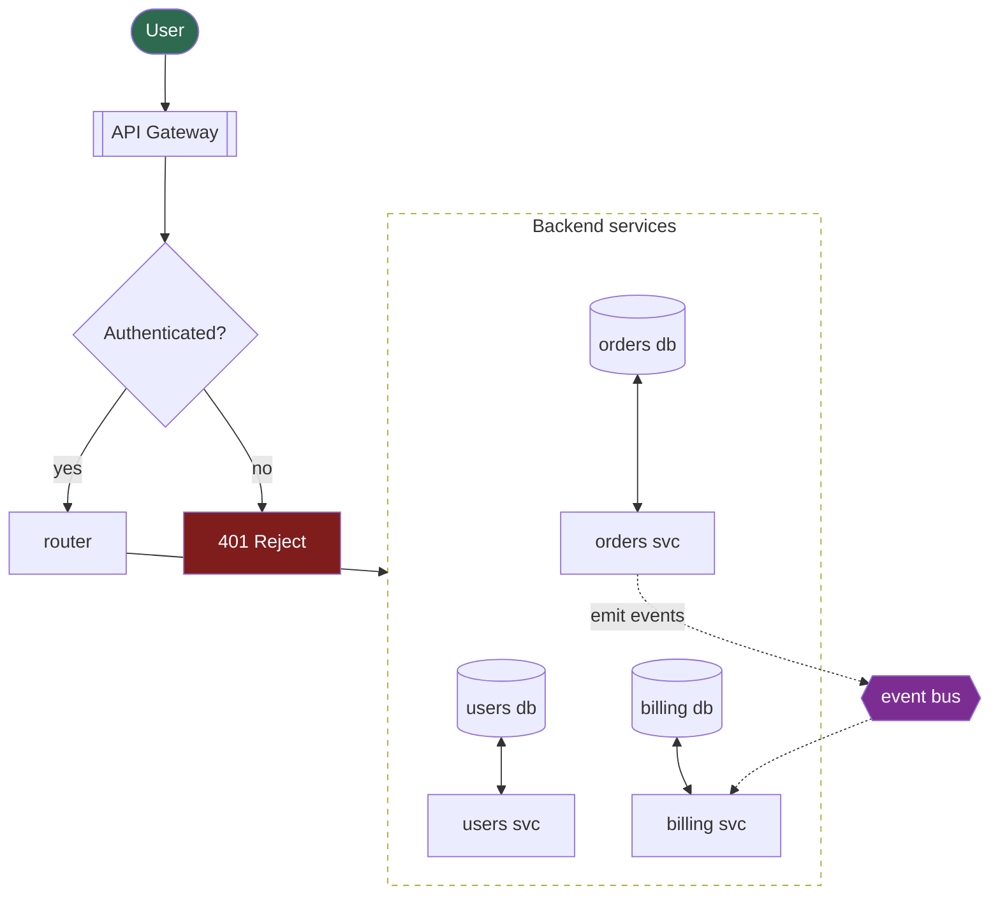
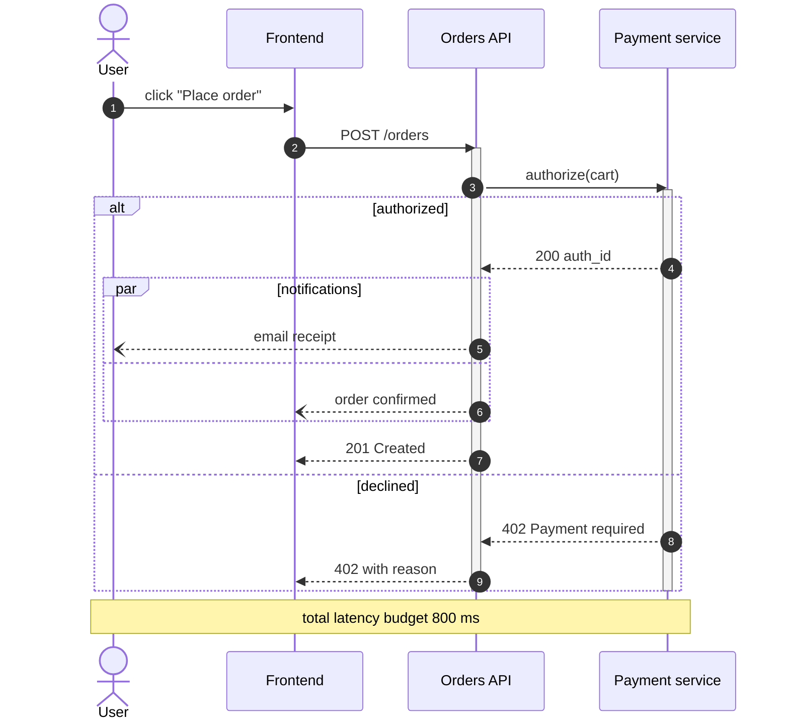
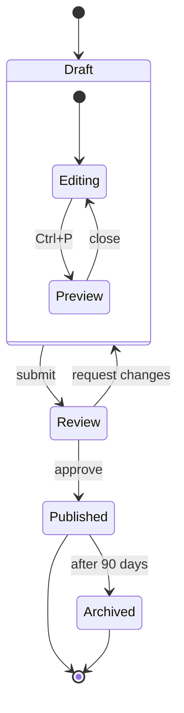
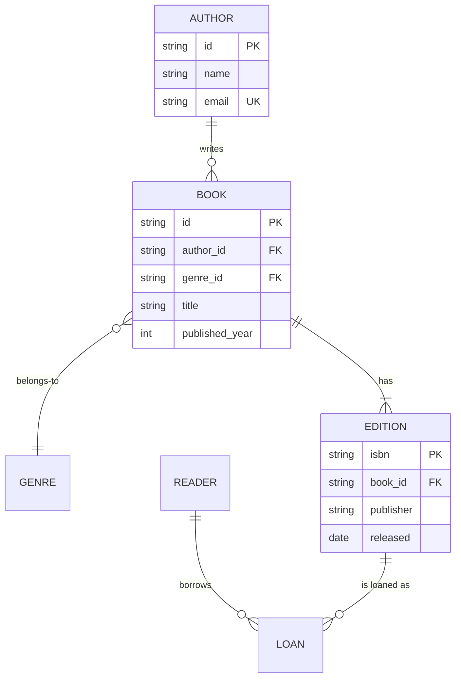
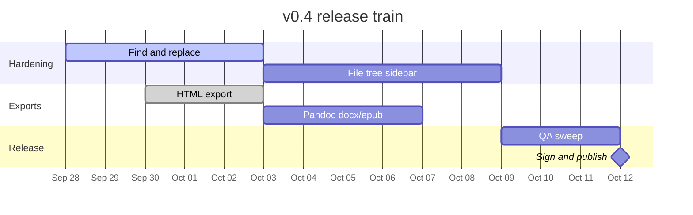
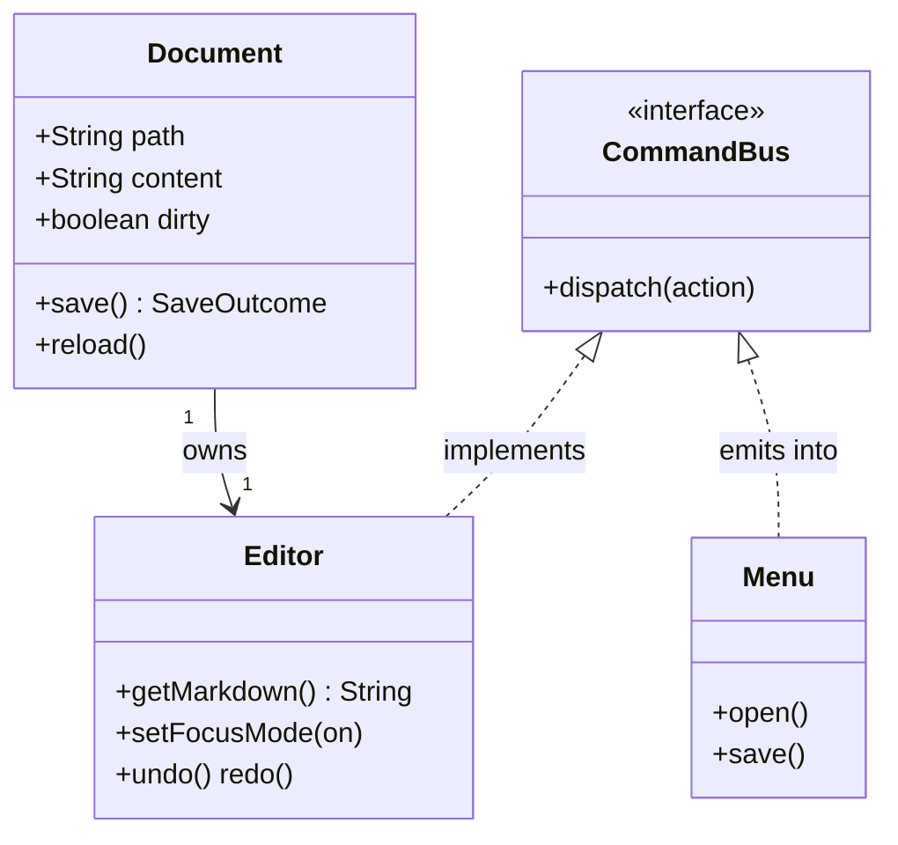
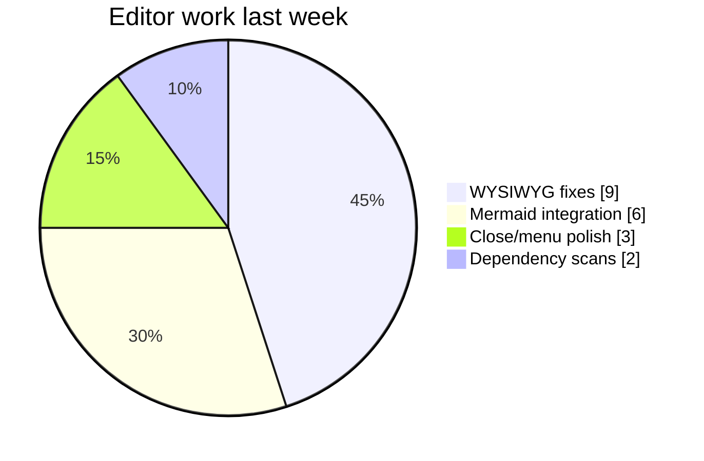
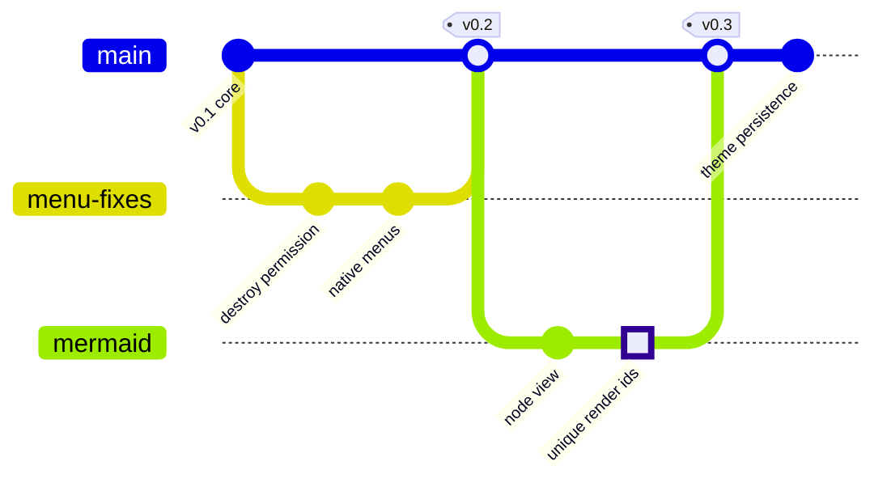

# Mermaid showcase

A tour of the diagram types Marky renders live. Edit any fence — the
diagram re-renders as you type, and syntax errors are flagged inline.

## Flowchart with subgraphs and styling

## Sequence diagram with alternatives and parallel work

## State machine of a document

## Entity relationship diagram

## Gantt: release train

## Class diagram

## Pie: where the time goes

## Git graph of this release

